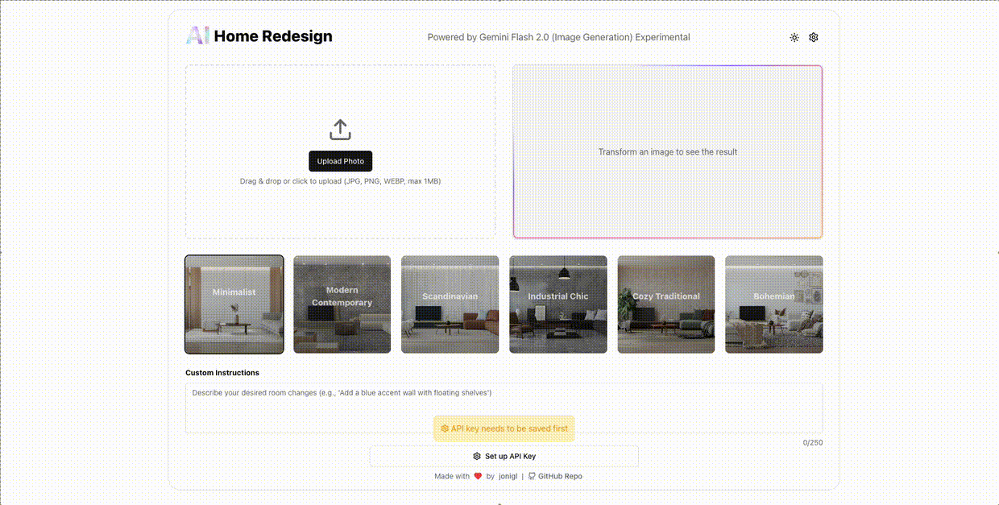

# 🏠 AI Home Redesign

[](https://github.com/jonigl/ai-home-redesign/actions/workflows/github-page-deploy.yml) [](https://opensource.org/licenses/MIT) 

AI Home Redesign is a web application that transforms photos of your rooms into different interior design styles using Google's Gemini Flash 2.0 Image Generation API (Experimental).

## 🔗 Live Demo

**Try it now:** [https://jonigl.github.io/ai-home-redesign/](https://jonigl.github.io/ai-home-redesign/)



## ✨ Features

- 🖼️ Upload room photos via drag-and-drop or file selection
- 🎨 Transform rooms into different design styles with one click
- 🔍 Choose from a variety of pre-defined interior design styles
- ✏️ Add custom instructions to further personalize your room transformation
- 📱 Responsive design for desktop and mobile devices
- 🌓 Light and dark mode
- 💾 Download transformed images
- 📤 Share your designs on social media platforms

## 🚀 Getting Started

You can use the application directly in your browser at [https://jonigl.github.io/ai-home-redesign/](https://jonigl.github.io/ai-home-redesign/) or set up your own local instance following the instructions below.

### Prerequisites

- Node.js (version 20 or above)
- Google Gemini API key

### Installation

1. Clone the repository:
```
git clone https://github.com/jonigl/ai-home-redesign.git
cd ai-home-redesign
```

2. Install the dependencies:
```
pnpm install
```

3. Start the development server:
```
pnpm run dev
```

4. Open your browser and navigate to `http://localhost:5173`

## 🔑 Getting Your Google Gemini API Key

This application requires a Google Gemini API key to function properly. Follow these steps to get your own API key:

1. Visit [Google AI Studio](https://makersuite.google.com/)
2. Sign in with your Google account
3. Go to "Get API key" in the menu
4. Create a new API key or use an existing one
5. Copy the API key

For more detailed instructions, visit: https://ai.google.dev/gemini-api/docs/api-key

## 📖 How to Use

1. **Set Up Your API Key**:
   - Click the settings icon in the top-right corner
   - Paste your Google Gemini API key
   - Click "Save API Key"

2. **Upload Your Room Photo**:
   - Drag and drop an image onto the upload area, or click to select a file
   - Supported formats: JPG, PNG, WebP (max 10MB)

3. **Choose a Style**:
   - Select one of the predefined interior design styles from the style selector

4. **Add Custom Instructions** (Optional):
   - Enter any specific details or changes you'd like to see in the redesigned room

5. **Transform Your Room**:
   - Click the "Transform Room" button
   - Wait for the AI to process your image (this may take a few seconds)

6. **View and Save the Result**:
   - Download the transformed image
   - Share it on social media if desired

7. **Chain Transformations** (Optional):
   - Check "Use last generated" to apply a new transformation to the previously generated image

## 🛠️ Technologies

- **Frontend**: React, TypeScript, TailwindCSS
- **AI**: Google Gemini Flash 2.0 Image Generation API
- **UI Components**: shadcn/ui
- **State Management**: React Context
- **Notifications**: Sonner

## 🔄 API Usage

This application uses the experimental Gemini Flash 2.0 Image Generation API, which:
- Transforms room images into new design styles
- Processes input images and generates redesigned versions
- Returns base64-encoded image data

Learn more about the Gemini 2.0 Flash Image Generation: [Google Developers Blog](https://developers.googleblog.com/en/experiment-with-gemini-20-flash-native-image-generation/)

## 📄 License

This project is licensed under the MIT License - see the LICENSE file for details.

## 👏 Acknowledgements

- [Google Gemini API](https://ai.google.dev/) for the image transformation capabilities
- [vite](https://vitejs.dev/) for the build tool
- [React](https://reactjs.org/) for the frontend framework
- [TypeScript](https://www.typescriptlang.org/) for static typing
- [shadcn/ui](https://ui.shadcn.com/) for UI components
- [MagicUI](https://magicui.design/) for magic UI components
- [TailwindCSS](https://tailwindcss.com/) for styling
- [Lucide](https://lucide.dev/) for icons
- [twemoji](https://github.com/twitter/twemoji) for emojis
- [Sonner](https://sonner.io/) for notifications
- [GitHub Copilot](https://copilot.github.com/) for code suggestions
- [bolt.new](https://bolt.new/) for quick project setup
- All the developers and designers who have contributed to the libraries and tools used in this project

---

Made with ❤️ by [jonigl](https://github.com/jonigl)
